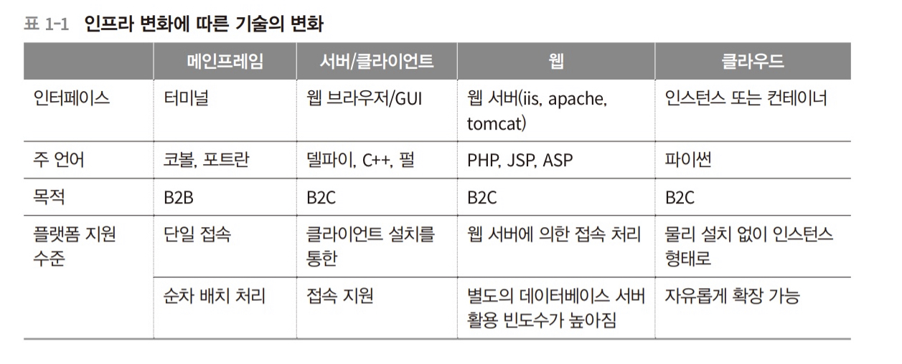

# Chapter1

## 1.1 인프라와 스프링 프레임워크의 변화

* 오픈소스(open source)들을 조합해서 서비스를 출시하는 경우가 일반화 되고 있다.
* 이번 장에서는 배경 지식을 습득하고 분위기를 익히는 차원에서 인프라의 변화와 이에 따른 자바 기술의 변화에 관해서 다룬다.

### 1.1.1 아키텍처의 변화

* 초기에는 일반 사용자를 위한 B2C 사업모델이 많지 않았으나, 웹이 활성화되며 B2C로의 트렌드 변화가 인프라의 아키텍처를 바꾸었다.
* 

### 1.1.2 스프링 프레임워크의 변화

* 스프링도 초기에는 EJB에 비해 가벼운 프레임워크였으나, 다른 언어의 프레임워크에 비해 무겁고 설정할 것이 많은 프레임워크가 되었다. 이 문제를 해결하기 위해서 스프링 부트(Spring Boot)를 만들었다.
* 스프링 부트는 설정 자동화(AutoConfigure)를 이용해서 스프링 MVC 모듈의 DispatcherServlet 설정, JDBC DataSource 설정 등 웹 개발을 하는 데 필요한 인프라성 코드들을 제공해 줌으로써 복잡한 XML 설정을 하지 않아도 개발을 시작할 수 있다.

​    

## 1.2 웹 애플리케이션 컨테이너

* 웹 애플리케이션 컨테이너(Web Application Container): 웹 어플리케이션이 배포되는 공간을 뜻한다.

### 1.2.1 자바 개발을 위해 꼭 필요한 클래스 로더

* "한번 작성하면 플랫폼에 상관없이 쓸 수 있다.(Write once, run anywhere)" -> 클래스 로더(class loader) 기술을 통해 가능하다.
* JVM이 컴파일된 클래스를 실행하기 위해서는 클래스를 로딩하는 과정이 필요한데, 그 과정을 수행하는 것이 클래스 로더이다.

#### 1.2.1.1 클래스 로더의 특징

1. 계층적이다.
2. 클래스 로딩을 위임할 수 있다.
3. 가시적인 규약이 있다.
4. 클래스 언로딩 불가능이다.

#### 1.2.1.2 클래스 로더의 유형

1. Bootstrap Class Loader
2. Extension Class Loader
3. System Class Loader
4. User-Defined Class Loader(s)

​    

## 1.3 WAR 파일의 특성

* 배포시에 로컬 실행 프로그램은 JAR, 웹은 WAR로 패키징한다.