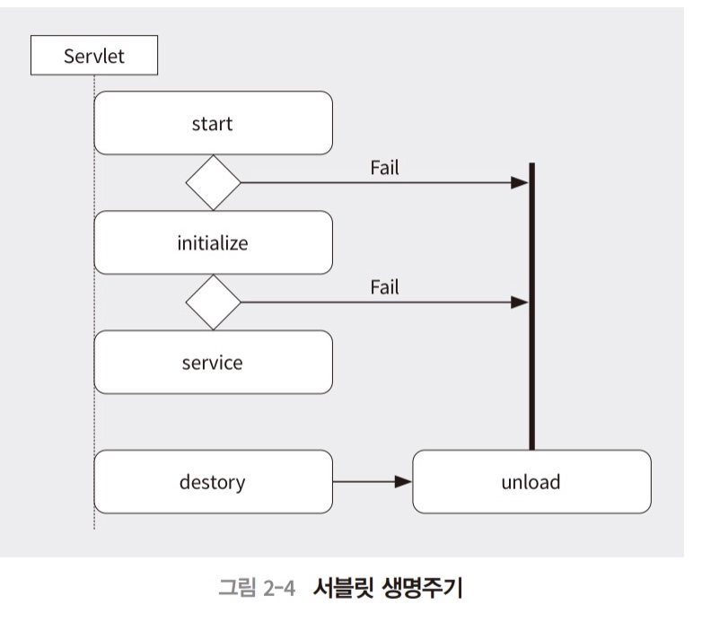

# Chapter2

## 2.1 서블릿 시작하기

* 서블릿은 JVM 기반에서 웹 개발을 하기 위한 명세이자 API이다.
* Java EE(Enterprise Edition)에 포함된 스펙 중의 하나로 자바에서 HTTP 요청과 응답을 처리하기 위한 내용들을 담고 있다.

### 2.1.1 서블릿 설정

* ​    그래들(Gradle) = 메이븐 = 엔트 = 빌드도구

#### 2.1.1.1 그래들을 이용한 서블릿 설정

## 2.2 서블릿 내부 동작

### 2.2.1 서블릿의 생명주기

* 웹 어플리케이션 컨테이너에서 콘텍스트가 초기화되면 생명주기가 시작된다.
* 
* 초기화(initialize) -> 서비스(service) -> 소멸(destroy)

#### 2.2.1.1 서블릿 초기화와 init 메서드

* init 메서드는 서블릿 초기화 시에 동작하는 메서드이므로, 여러분 호출해도 한번만 동작한다.

## 2.3 서블릿 활용

### 2.3.1 HTTP 요청과 응답

#### 2.3.1.1 GET 요청 처리

* 서블릿에서 doGet메서드를 이용하여 GET 메서드 방식의 요청을 응답받을 수 있다.
* 받는 파라미터: HttpServletRequest, HttpServletResponse

#### 2.3.1.2 POST 요청 처리

* doPost 메서드를 활용한다. -> URL직접접근시 405에러 발생

#### 2.3.1.3 HTML 폼 데이터 전송

* HTML의 form에서 action과 method 속성을 이용한다.

### 2.3.2 멀티파트

* 멀티파트(multipart)는 바이너리 데이터 전송을 위해 사용
* ex.파일전송시, html의 form 에서 enctype="multipart/form-data"
* 서버코드에서 멀티파트 데이터 처리를 위해 MultiPartConfig 어노테이션 사용
* @fileSizeThreshold, @location, @maxFileSize, @maxRequestSize

